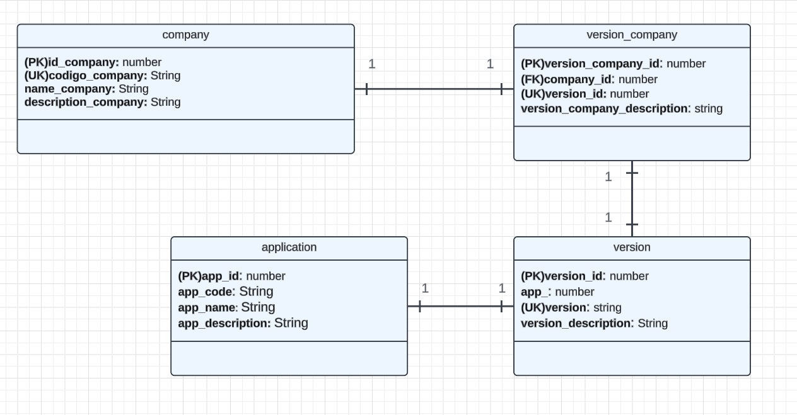

# 📌 Ada API - Gestión de Compañías

## 📖 Explicación del Modelo de Datos
Cada compañía tiene su propia versión. A su vez, cada versión de la compañía está asociada con una versión específica de una aplicación. Es importante destacar que:

✅ Una compañía solo puede tener una única versión.
✅ Cada versión de la compañía se asocia con una única versión de una aplicación.
✅ Cada aplicación está vinculada exclusivamente a su propia versión.

### 🗂️ Modelo de Base de Datos


---

## 🚀 Cómo Ejecutar la API
1️⃣ Crear una base de datos con el nombre **"adadb"**, o si se usa otro nombre, modificar la configuración en el archivo `application.properties`.
2️⃣ En la terminal, ejecutar:
   ```sh
   mvn spring-boot:run
   ```
3️⃣ Para probar la API, acceder a la URL: http://localhost:8080/api/swagger-ui/index.html#/Company

---

## 🐞 Bug Conocido
⚠️ Actualmente, existe un problema con **MapStruct**, lo que impide que la entidad **Company** se mapee correctamente.

